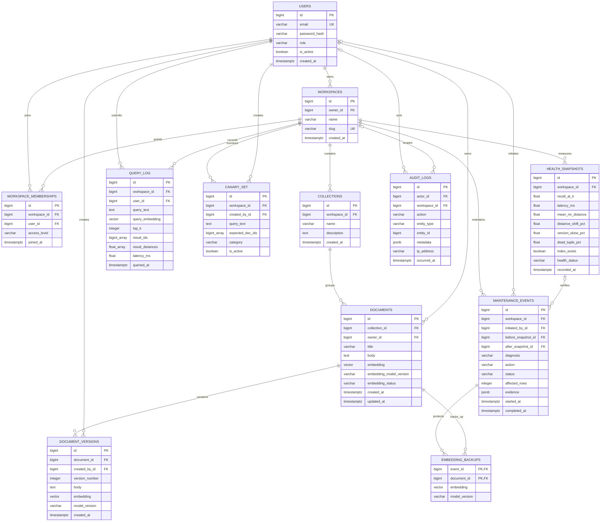

# Database Design Draft

Status: **Draft for team/faculty review — do not migrate yet**

Application domain: Secure Semantic Knowledge Base with Self-Healing Vector
Search.

## ER diagram

## Relational schema

1. `USERS(id PK, email UK, password_hash, role, is_active, created_at)`
2. `WORKSPACES(id PK, owner_id FK→USERS.id, name, slug UK, created_at)`
3. `WORKSPACE_MEMBERSHIPS(id PK, workspace_id FK→WORKSPACES.id,
   user_id FK→USERS.id, access_level, joined_at,
   UK(workspace_id,user_id))`
4. `COLLECTIONS(id PK, workspace_id FK→WORKSPACES.id, name, description,
   created_at, UK(workspace_id,name))`
5. `DOCUMENTS(id PK, collection_id FK→COLLECTIONS.id,
   owner_id FK→USERS.id, title, body, embedding VECTOR(64),
   embedding_model_version, embedding_status, created_at, updated_at)`
6. `DOCUMENT_VERSIONS(id PK, document_id FK→DOCUMENTS.id,
   created_by_id FK→USERS.id, version_number, body, embedding VECTOR(64),
   model_version, created_at, UK(document_id,version_number))`
7. `QUERY_LOG(id PK, workspace_id FK→WORKSPACES.id,
   user_id FK→USERS.id, query_text, query_embedding VECTOR(64), top_k,
   result_ids, result_distances, latency_ms, source, queried_at)`
8. `CANARY_SET(id PK, workspace_id FK→WORKSPACES.id,
   created_by_id FK→USERS.id, query_text, expected_doc_ids, category,
   is_active, created_at)`
9. `HEALTH_SNAPSHOTS(id PK, workspace_id FK→WORKSPACES.id, recall_at_k,
   avg_latency_ms, p95_latency_ms, mean_nn_distance, p95_nn_distance,
   distance_shift_pct, version_skew_pct, dead_tuple_pct, index_exists,
   index_used, health_status, issues, recorded_at)`
10. `MAINTENANCE_EVENTS(id PK, workspace_id FK→WORKSPACES.id,
    initiated_by_id FK→USERS.id NULL, before_snapshot_id
    FK→HEALTH_SNAPSHOTS.id, after_snapshot_id FK→HEALTH_SNAPSHOTS.id,
    trigger_source, diagnosis, action, status, affected_rows, evidence,
    error_message, started_at, completed_at)`
11. `EMBEDDING_BACKUPS(event_id PK/FK→MAINTENANCE_EVENTS.id,
    document_id PK/FK→DOCUMENTS.id, embedding VECTOR(64), model_version)`
12. `AUDIT_LOGS(id PK, actor_id FK→USERS.id NULL,
    workspace_id FK→WORKSPACES.id NULL, action, entity_type, entity_id,
    metadata, ip_address, occurred_at)`

## Current-to-target migration map

| Existing object | Target treatment |
|---|---|
| `documents` | Preserve data; add collection, owner, title, status and update fields |
| `query_log` | Preserve; add authenticated user and workspace relationships |
| `canary_set` | Preserve; scope to workspace and creator |
| `health_snapshots` | Preserve; scope to workspace |
| `fault_runs` | Evolve into `maintenance_events`; retain experiment history |
| `fault_embedding_backups` | Evolve into `embedding_backups`; retain exact vectors |
| Python monitoring scripts | Move behind Django services/management commands |
| `psycopg2` queries | Replace normal CRUD with ORM; retain justified advanced SQL |

No current table or experiment data needs to be discarded.

## Key constraints

| Table | Constraint |
|---|---|
| `users` | `UNIQUE(email)`, role `CHECK IN ('ADMIN','MEMBER')` |
| `workspaces` | `UNIQUE(slug)`, owner required |
| `workspace_memberships` | `UNIQUE(workspace_id,user_id)`, access-level check |
| `collections` | `UNIQUE(workspace_id,name)` |
| `documents` | non-empty title/body, embedding-status check |
| `document_versions` | `UNIQUE(document_id,version_number)`, positive version |
| `query_log` | `top_k > 0`, `latency_ms >= 0` |
| `health_snapshots` | percentages constrained to `0..100`; recall `0..1` |
| `maintenance_events` | diagnosis/action/status checks; completion consistency |
| `embedding_backups` | composite primary key prevents duplicate backups |

## Planned indexes

- HNSW cosine index on `documents.embedding`.
- B-tree on every foreign key used for joins.
- `users(email)` unique index.
- `workspaces(slug)` unique index.
- `documents(collection_id, updated_at DESC)` for listing/pagination.
- `documents(owner_id, updated_at DESC)` for owner filtering.
- `query_log(workspace_id, queried_at DESC)`.
- `health_snapshots(workspace_id, recorded_at DESC)`.
- `maintenance_events(workspace_id, started_at DESC)`.
- `audit_logs(workspace_id, occurred_at DESC)`.

## 3NF justification

- Every relation has a primary key and atomic values, satisfying 1NF. Arrays in
  query/canary telemetry represent one captured search result, not independent
  business entities; this choice must be explained during evaluation.
- Memberships resolve the many-to-many relationship between users and
  workspaces, satisfying 2NF without repeated workspace/user groups.
- Collections, document versions, health snapshots and maintenance events are
  separate because their attributes depend on their own keys, not transitively
  on document or workspace descriptions.
- User role is stored once in the single users table, as required; user details
  are not duplicated in role-specific tables.
- Collection/workspace names and user emails are referenced by keys rather than
  copied into documents, logs or events.
- Derived dashboard values belong in views/queries, not duplicated columns.

Final 3NF approval requires reviewing functional dependencies after Django
models are finalized.

## Required database-programming evidence

### View

`workspace_health_summary`: latest health state, document count, query count and
last maintenance result per workspace.

### Stored procedure

`archive_document_version(document_id, actor_id, new_body)`: insert immutable
version history, update the current document and mark its embedding stale in one
database transaction.

### Trigger

After document content changes, append an audit event and mark the embedding
status `STALE` if the application did not provide a replacement embedding.

### Transaction demonstration

Create a document, create version 1 and append its audit log atomically. A test
will intentionally fail the last operation and verify that all three writes are
rolled back.

## Approval questions before implementation

1. Is the registered course code `BCSE307L` or `BCSE302P`?
2. Is “Secure Semantic Knowledge Base” acceptable as the faculty-approved
   organizational application domain?
3. Are `ADMIN` and `MEMBER` the desired two roles?
4. Does the faculty interpret “8–10 tables” as a recommended range or a hard
   maximum? This draft has 12 justified relations.
5. Confirm the proposed Kush/Arnav responsibility split.
