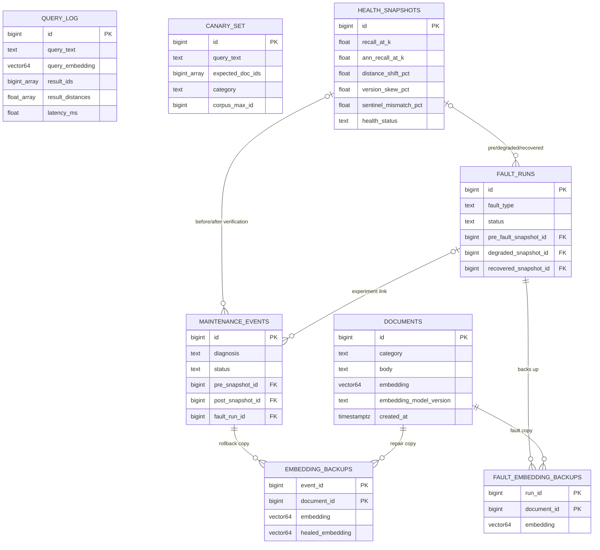
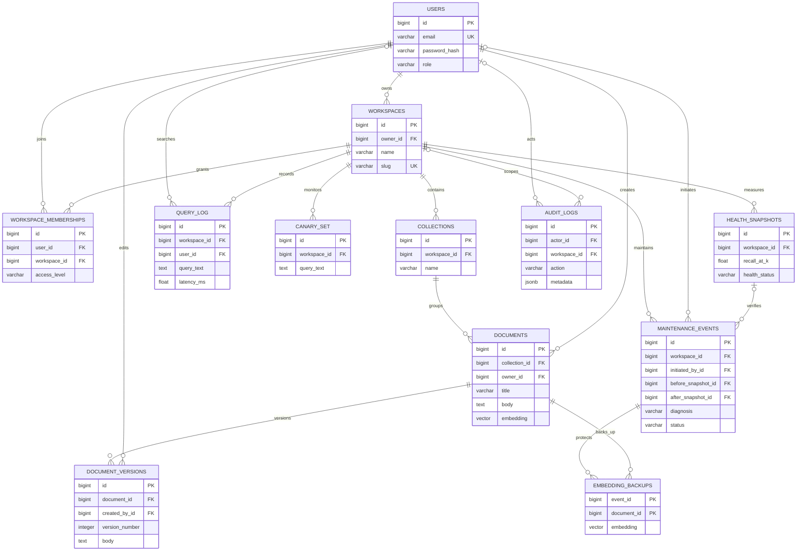

# Vectra — Self-Healing Semantic Knowledge Base

Vectra combines a **semantic document workspace** with a **self-healing PostgreSQL vector-search subsystem**. Users should ultimately be able to securely manage documents, search by meaning, explore their relationships, and see whether search quality is healthy. When supported faults occur, the system measures the problem, diagnoses a repair class, applies a targeted fix, re-measures, and records or rolls back the outcome.

> **Current versus goal:** the React/Django web app is a local **read interface** for graph browsing, search, nearest neighbors, and health history. The opt-in Python healer implements the closed repair loop and has been tested in controlled experiments. Login, roles, document CRUD, the final application schema, backup/restore evidence, Docker, and a live deployment are **not yet implemented**. The proposed ER diagram below is a design, not a claim about today's database.

## Why this project exists

Keyword search can miss related documents. Vector search improves retrieval but can silently degrade when embeddings are stale or incompatible, the HNSW index is missing or unhealthy, or table churn creates bloat. A broad rebuild wastes work and may block users. Vectra's central question is: **what broke, which rows or structures need repair, and did the fix restore quality?**

The demo has **480 documents in six categories**. Its default offline embedder produces **64-dimensional TF-IDF + SVD vectors**; the experiment suite also supports real **384-dimensional BGE/MiniLM** embedders. pgvector stores vectors and compares them with cosine distance; HNSW is the approximate-nearest-neighbor **index**, not the ML model. Categories are metadata for grouping/filtering, not separate databases, so a query can cross categories.

```text
React graph/search → Django REST API → PostgreSQL + pgvector
                                            ├─ documents + HNSW index
                                            ├─ queries + canaries + health snapshots
                                            └─ maintenance events + vector backups

Opt-in monitor → measure → diagnose → targeted repair → re-measure
                       └──────── accept / roll back / escalate + audit ────────┘
```

### Search and healing in DBMS terms

1. **Store and retrieve:** each `documents` row contains text, category, model version, and vector. The API embeds a query with the same model and ranks documents by pgvector cosine distance. `query_log` records query text, result IDs/distances, and latency. The React graph is a navigation layout, **not** a literal projection of 64D coordinates.
2. **Measure:** frozen queries in `canary_set` and live checks evaluate Recall@k, ANN-versus-exact recall, distance shift, model-version skew, sentinel vector/text mismatch, index state, latency, and dead tuples. Each check becomes a `health_snapshots` row.
3. **Diagnose:** explicit rules map evidence to supported repair classes: re-embed stale/mismatched rows, rebuild a missing/degraded HNSW index, vacuum bloat, or investigate unexplained symptoms. Unknown/ambiguous problems are escalated rather than guessed away.
4. **Repair and verify:** the healer saves old vectors in `embedding_backups`, acts only on diagnosed targets, takes a new snapshot, and accepts the result only if verification passes. Otherwise it rolls back or escalates. `maintenance_events` links diagnosis, action, affected rows, status, and pre/post evidence. Advisory locking, crash recovery, cooldown memory, and optimistic concurrency guard the process.

This is **rule-based database diagnosis**, not an ML model choosing repair actions. ML creates embeddings; PostgreSQL measurements and rules drive the healer. The default TF-IDF model can reject an all-unknown-vocabulary query rather than return meaningless vector matches.

## Stack and delivery status

| Layer | Working now | End goal |
|---|---|---|
| UI | React/TypeScript graph, semantic search, filters, detail panel, health cards | Login, role-aware menus/pages, document CRUD, pagination and validation |
| API | Django REST Framework read endpoints; ORM mappings of existing tables | Authenticated, role-protected Django ORM CRUD and reporting |
| Database | PostgreSQL + pgvector; HNSW, query/health/fault/repair tables | Approved 3NF application schema, joins, constraints, view, procedure and trigger |
| Healing | Opt-in Python monitor: detect → diagnose → repair → verify/rollback → audit | Controlled application operation, alerts and admin workflow |
| Operations | Local Windows launcher and experiment scripts | Tested PostgreSQL backup/restore, Docker, CI/CD and cloud deployment |

## ER diagram A — implemented PostgreSQL schema

This reflects [`selfheal_pgvector/sql/schema.sql`](selfheal_pgvector/sql/schema.sql): **eight tables**. The lines represent declared foreign keys. `query_log.result_ids` and `canary_set.expected_doc_ids` are captured ID arrays, **not FK constraints**, so they are not drawn as enforced relationships.



**How to read it:** `DOCUMENTS` is the searchable entity. `QUERY_LOG` records searches, `CANARY_SET` defines regression expectations, and `HEALTH_SNAPSHOTS` stores time-stamped measurements. `FAULT_RUNS` plus its backups make controlled experiments reversible. A `MAINTENANCE_EVENTS` row refers to before/after health snapshots; its `EMBEDDING_BACKUPS` rows identify exactly which document vectors could be rolled back. Both backup tables have composite primary keys. Each summarized snapshot line above represents multiple actual FK columns. This is a working search/observability schema, **not yet** the final organizational 3NF submission.

## ER diagram B — proposed full application schema

This is the **design target**, drawn from [`DATABASE_DESIGN_DRAFT.md`](DATABASE_DESIGN_DRAFT.md), **not a live migration**. It wraps users/workspaces/collections/document history and application audit around the existing search and repair data. Existing fault-experiment history must be preserved or migrated deliberately. The draft has 12 justified relations; the faculty's “8–10 related tables” wording and final 3NF design need approval before migrations.



**DBMS interpretation:** one `USERS` table holds `ADMIN`/`MEMBER` roles; `WORKSPACE_MEMBERSHIPS` resolves the user–workspace many-to-many relationship; `COLLECTIONS` groups documents without repeating workspace names; `DOCUMENT_VERSIONS` preserves edits; query, canary, health, maintenance and audit rows are scoped to a workspace. Foreign keys and unique constraints enforce ownership and identity. Ordinary CRUD should use Django ORM; parameterized SQL remains appropriate for pgvector operators and maintenance. The [design draft](DATABASE_DESIGN_DRAFT.md) contains the relational schema, indexes, constraints and proposed 3NF rationale.

## Evidence, limits and next work

In a controlled Phase 4 experiment, 25% model drift reduced Recall@10 from **1.000 to 0.775**; diagnosis and targeted re-embedding restored **1.000**. Phase 5 tested silent corruption, degraded/invalid indexes, concurrent writers, process/database failures, 20k TF-IDF rows, and 5k rows with a real BGE embedder. Its fault-tolerance suite reports **17/17** scenarios passing. These are reproducible experiments, **not production guarantees**. See [Phase 4](selfheal_pgvector/PHASE4.md), [Phase 5](selfheal_pgvector/PHASE5.md), and [raw results](selfheal_pgvector/results/).

Next, mandatory academic marks come first: approve the ER model and resolve **BCSE302P versus BCSE307L**; implement application tables/ORM CRUD/joins/views/procedure/trigger; add secure login, roles, validation and pagination; connect controlled healing to the app; then prove backup/restore, Docker and cloud deployment. See the [proposal](PROJECT_PROPOSAL.md) and [rubric roadmap](ACADEMIC_REQUIREMENTS_AND_ROADMAP.md). None of those pending deliverables is claimed complete here.

## Run the current local demo

On the configured Windows development machine, from the repository root:

```powershell
.\web\start-local.ps1
```

Open <http://127.0.0.1:5173/>. This starts/checks **local** PostgreSQL, Django and Vite; it does not deploy the application. See [web/README.md](web/README.md) for prerequisites, manual commands and API routes, and [selfheal_pgvector/README.md](selfheal_pgvector/README.md) for the CLI experiments and monitor.
